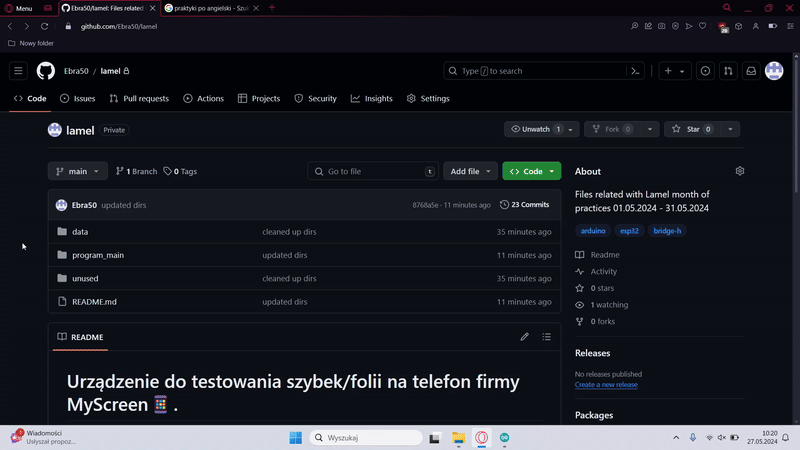
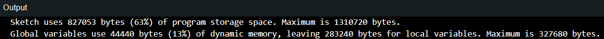
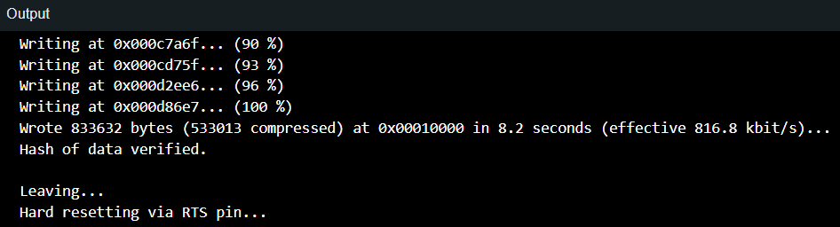

# **Urządzenie do testowania szybek/folii na telefon firmy MyScreen📱.**

## Proces instalacji i przygotowania środowiska do przeprowadzenia konfiguracji ESP.  
Do poprawnego działania programu ESP (płytka odpowiedzialna za sterowanie silnikiem oraz innymi urządzeniami) wymaga sieci WiFi, z wykorzystaniem Hotspota możemy takową stworzyć. 

Aby zmiany zadziałały musimy skompilować program oraz go zuploadować do ESP. W tym celu wykorzystujemy Arduino IDE [Download link for windows](https://downloads.arduino.cc/arduino-1.8.19-windows.exe)



## **Jak skonfigurować urządzenie do pokazu?**

Po otwarciu pliku (proces ukazany na gifie wyżej) odszukujemy linijki odpowiedzialne za credentialsy (SSID, hasło do sieci Hotspot). Wprowadzamy tam nazwę sieci (SSID) oraz hasło do sieci. 

```
const char* ssid = "WPROWADŹ TUTAJ NAZWĘ SWOJEJ SIECI DO KTÓREJ CHCESZ PODŁĄCZYĆ ESP";
const char* password = "HASŁO DO SIECI";
```

Po wprowadzaniu SSID i hasła sieci, klikamy kombinację klawiszy CNTRL + U aby zuploadować plik na płytkę. Jeśli zobaczymy następujacę logi w konsoli. 



Oraz 



Oznacza to że program został wgrany poprawnie.

### Potencjalne problemy:

1. Podczas uploadowania pliku błąd 0x13 (Wrong boot mode detected) - Aby rozwiązać problem należy podczas uploadowania pliku wcisnąć przycisk na płytce "BOOT"

2. Podczas uploadowania pliku błąd: Failed to connect to ESP32: No data serial received. Aby rozwiązać ten problem należy sprawdzić czy płytka nie uległa uszkodzeniu tzn. czy nie ma luźnych przewodów itd.

3. Strona nie odpowiada. Aby rozwiązać ten problem należy upewnić się czy laptop jest podłączony do tej samej sieci jak ESP jest.

4. Monitor szeregowy jest zasypany różnymi logami związanymi z restartowniem ESP - aby rozwiązać ten problem należy, odpiąć około 10 sekund zasilanie płytki np. z portu USB laptopa lub zasilacza. Jeżeli to nie pomoże oznacza to, że najprawdopobniej mamy problem w programie który zakłóća działania mikrokontrolera.

5. Monitor Szeregowy pokazuje dziwne znaki, nie outputuje tego co powinno (Przykładowy poprawny output znajduje sie na dole tego repozytorium). Aby rozwiązać ten problem, należy upewnić się czy monitor szeregowy ma ustawiony poprawny baudrate - w tym przypadku powninien wynosić 115200 bps.
