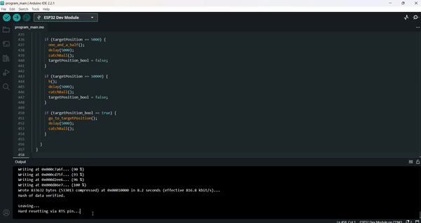

# **Urządzenie do testowania szybek/folii na telefon firmy MyScreen📱.**

## Proces instalacji i przygotowania środowiska do przeprowadzenia konfiguracji ESP.  
Do poprawnego działania programu ESP (płytka odpowiedzialna za sterowanie silnikiem oraz innymi urządzeniami) wymaga sieci WiFi, z wykorzystaniem Hotspota możemy takową stworzyć. 

Aby zmiany zadziałały musimy skompilować program oraz go zuploadować do ESP. W tym celu wykorzystujemy Arduino IDE [Download link for windows](https://downloads.arduino.cc/arduino-1.8.19-windows.exe)


## **Jak skonfigurować urządzenie do pokazu?**

Po otwarciu pliku (proces ukazany na gifie wyżej) odszukujemy linijki odpowiedzialne za credentialsy (SSID, hasło do sieci Hotspot). Wprowadzamy tam nazwę sieci (SSID) oraz hasło do sieci. 

```
const char* ssid = "WPROWADŹ TUTAJ NAZWĘ SWOJEJ SIECI DO KTÓREJ CHCESZ PODŁĄCZYĆ ESP";
const char* password = "HASŁO DO SIECI";
```

Po wprowadzaniu SSID i hasła sieci, klikamy kombinację klawiszy CNTRL + U aby zuploadować plik na płytkę. Jeśli zobaczymy następujacę logi w konsoli. 


Oraz 


Oznacza to że program został wgrany poprawnie. Jeśli nie udało się zobacz sekcje **Potencjalne problemy**.

Aby odnaleźć adres IP urządzenia, po wgraniu programu należy w górnym pasku przejść do **Tools** -> **Serial Monitor**. 

Proces ukazny na poniższym gifie.



### Potencjalne problemy:

1. Podczas uploadowania pliku błąd 0x13 (Wrong boot mode detected) - Aby rozwiązać problem należy podczas uploadowania pliku wcisnąć i trzymać przycisk na płytce "BOOT"

2. Podczas uploadowania pliku błąd: Failed to connect to ESP32: No data serial received. Aby rozwiązać ten problem należy sprawdzić czy płytka nie uległa uszkodzeniu tzn. czy nie ma luźnych przewodów.

3. Strona nie odpowiada. Aby rozwiązać ten problem należy upewnić się czy laptop jest podłączony do tej samej sieci jak ESP jest. Ewentualnie można wyczyścić cache przeglądarki.

4. Monitor szeregowy jest zasypany różnymi logami związanymi z restartowniem ESP - aby rozwiązać ten problem należy, odpiąć około 10 sekund zasilanie płytki np. z portu USB laptopa lub zasilacza. Jeżeli to nie pomoże oznacza to, że najprawdopobniej mamy problem w programie który zakłóća działania mikrokontrolera.

5. Monitor Szeregowy pokazuje dziwne znaki, nie outputuje tego co powinno (Przykładowy poprawny output znajduje sie na górze tego repozytorium). Aby rozwiązać ten problem, należy upewnić się czy monitor szeregowy ma ustawiony poprawny baudrate - w tym przypadku powninien wynosić 115200 bps.

6. Monitor szeregowy nie wyświetla nic. Aby rozwiązać ten problem możemy spróbówać odłączyć płytkę od komputera ma około 5 - 10 sekund następnie z powrotem podłączyć ją do komputera. Jeśli to nie pomoże spróbuj zuploadować ponownie plik na płytkę.

Jeśli wszystko przebiegło pomyślnie zasialnie płytki z portu USB komputera można zamienić na zewnętrzny zasilacz. Urządzenie powinno działać zgodnie z założeniem. 